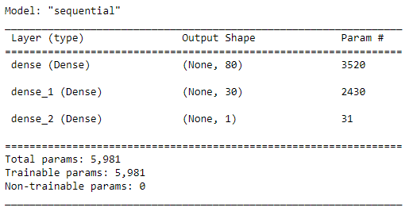
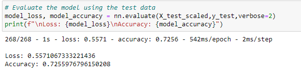
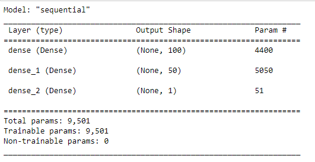
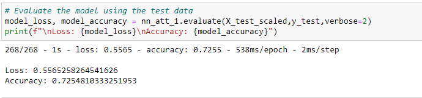
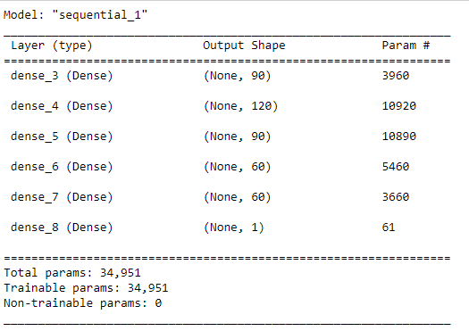
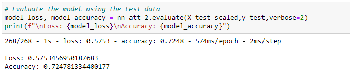
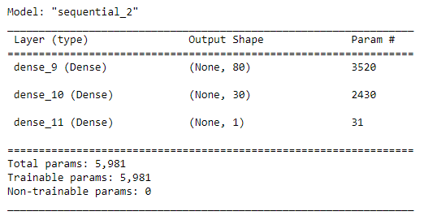
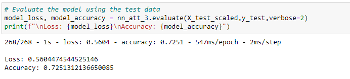
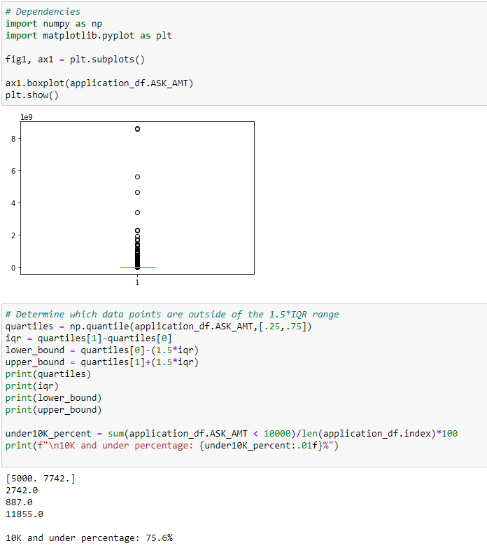

# Neural_Network_Charity_Analysis

## Overview of the loan prediction risk analysis:
This analysis is done to be able to predict using a neural network, based on the previous data, that if a donation is made to a certain entity, would it be put to good use or not.

## Results:

In order for our neural network to work, we first need to preprocess the input data, then compile, train and evaluate our model:

#### Data Preprocessing

By looking at the imput data, we can identify the following points:
- Target Variable:
- Features:
- Variables that do not have a meaningful contribution to our neural network, meaning removing them will not harm the result, but it will help increase the performance of our model. In this case, EIN and NAME which are identifications columns.

#### Compiling, Training, and Evaluating the Model
- How many neurons, layers, and activation functions did you select for your neural network model, and why?
The first model I just added two hidden layers. To the first layer I added 80 neurons, since rule of thumb is to have about 2 to three times the number of features as neurons. And to the second hidden layer I added 30 neurons. The activation function I chose was 'relu', since it is on of the most commonly used activation function in neural networks.

    

- Were you able to achieve the target model performance?

    Not really! With this neural model, the performance was not one we were looking for with accuracy of 72%, as shown below:

    

    So we will have to tweak our deep learning model to increase the performance. Fot this task we will try the followings:

- Additional neurons are added to hidden layers:
    
    
    
    As shown in the image below, the performance of the model didn't get boosted as we hoped:

    

    So, we will try another change:

- Additional hidden layers are added:

    
    
    This time we added extra hidden layers, increased the layers from 2 to 5 and also added more neurons to the layers. But again as the picture below is showing, we don't see much improvement in the model.

    

    So our third attempt in order to get to the performance we expect is to :

- The activation function of hidden layers or output layers is changed for optimization
    
    
    
    This time, instead of the popular relu function I used tanh activation function and also added to the epochs, which is the number of times, the data passes through the network, in order to learn from it. But still not much desired outcome as shown:

    

## Summary:
Looking at the results, we realize that non of the strategies we implemented, did much of a change in the performance of the model.
We added more neurons, more hidden layers, changed the activation functions, increased the epochs, none worked.

I looked at the feature ASK_AMT and realized that the donation amounts widely differ, mostly in the ball park of 5000 but there are also donations of over 1 billion dollars. I did a boxplot to find any outliers but couldn't on my own decide that the million and billion dollar donations are false and drop them out of the dataset. So we will have to double check with the dataset provider.

After double checking with the company to see if they have had such big donations or not, I will be able to either drop or keep them.
But even if they are valid data, I believe with such a wide range, we probably should split the data and run different models for donation under 10K which are 75% of the data and have another model or two for higher range donations, similar to binning and bucketing that we did at the beginning. With that in mind, I believe the answer to increase the model performance is in performing more preprocessing on the data.

